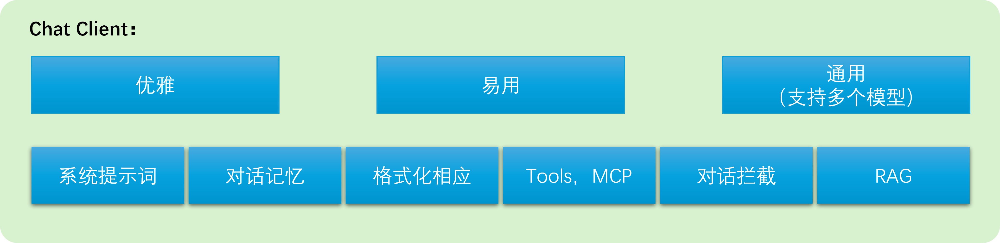

# Spring AI practice with DeepSeek API

### DeepSeek Models

- deepseek-chat - 模型指向DeepSeek-V3 - 不带思考
- deepseek-reasoner - 模型指向DeepSeek-R1 - 带思考

### DeepSeek开启深度思考

- 将模型指向DeepSeek-R1
- 将Output强制转换成DeepSeekAssistantMessage
- 通过getReasoningContent()方法拿到思考内容

```java
DeepSeekAssistantMessage assistantMessage = (DeepSeekAssistantMessage) r.getResult().getOutput();
String reasoningContent = assistantMessage.getReasoningContent();
```

### 接入阿里百炼

- 在父项目中添加依赖管理

```html
<!--阿里百炼依赖管理-->
<dependency>
    <groupId>com.alibaba.cloud.ai</groupId>
    <artifactId>spring-ai-alibaba-bom</artifactId>
    <version>${spring-ai-alibaba.version}</version>
    <type>pom</type>
    <scope>import</scope>
</dependency>
```

- 在子项目中添加百炼依赖

```html
<!--阿里百炼-->
<dependency>
    <groupId>com.alibaba.cloud.ai</groupId>
    <artifactId>spring-ai-alibaba-starter-dashscope</artifactId>
</dependency>
```

- 在子项目配置文件中添加百炼配置项

```html
## 阿里百炼 Configuration
spring.ai.dashscope.api-key=${DASH_SCOPE_KEY}
# model可以使用默认值
# spring.ai.dashscope.chat.options.model=
```

### Chat Client

